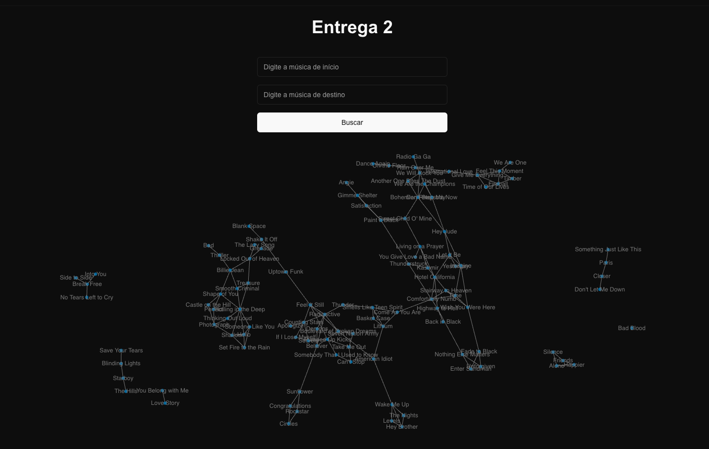
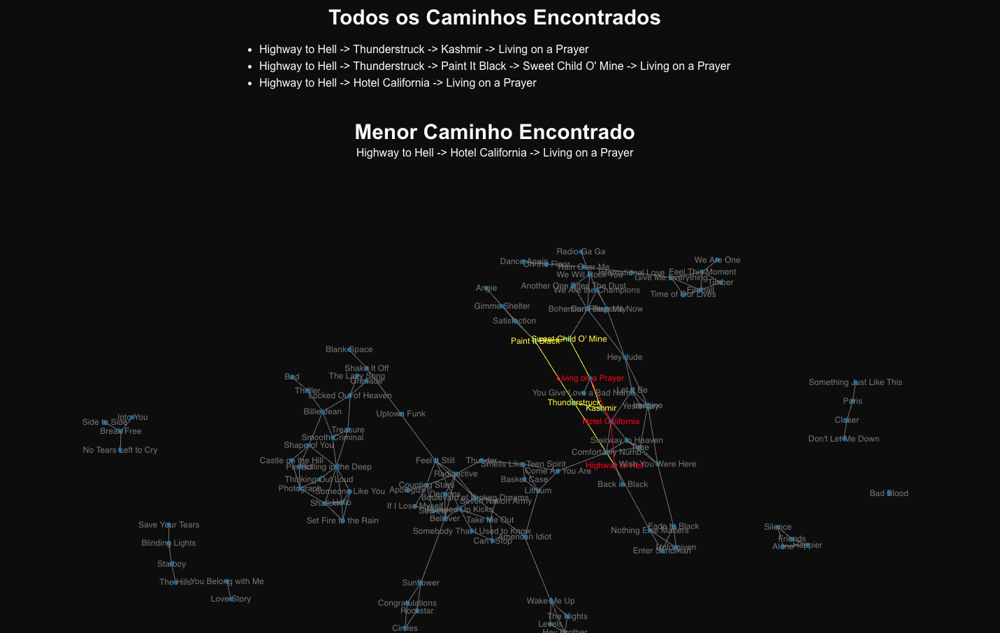

# Songz

**Número da Lista**: 2<br>
**Conteúdo da Disciplina**: Grafos 2<br>

## Alunos
| Matrícula | Aluno           |
| --------- | --------------- |
| 200054333 | Arthur Gabriel Lima Gomes |
| 211061350 | Alexandre de Santana Beck |

## Sobre 
Songz é um projeto desenvolvido para a disciplina de Projeto de Algoritmos, com o objetivo de explorar conceitos de teoria dos grafos aplicados para exibir caminhos entre músicas com base nos pesos das conexões. O sistema utiliza grafos para representar relações entre músicas, como conexões baseadas em gêneros musicais e colaborações entre artistas. O usuário insere duas músicas, e o sistema encontra os caminhos entre elas, exibindo-os visualmente como um grafo interativo, destacando as conexões ponderadas.

## Screenshots

### **Tela inicial**:


### **Escolhendo músicas**:


### **Grafo mostrando caminhos**:


## Instalação 
**Linguagem**: Javascript<br>
**Framework**: React<br>

É necessário ter o Node.js e npm instalado para rodar o projeto. Para instalar as dependências, execute o comando abaixo:

```npm install```

Para rodar o projeto, execute o comando abaixo:

```npm run dev```

O projeto estará disponível em `http://localhost:3000/`.


## Uso 

1. Nos campos de buscas, insira os nomes das música.
2. Clique no botão Buscar.
3. O grafo exibirá a música pesquisada e suas conexões com outras músicas relacionadas.
4. Você pode clicar nos nós para destacar conexões ou explorar o grafo utilizando zoom e arrastando os elementos.

## Outros

[Link para apresentação](https://youtu.be/J0KivVF_3kc?si=ACgStD9M8_o1Kyog)
